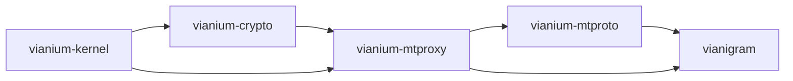

# vianium-mtproxy
[](LICENSE) [](https://github.com/vianium) [](https://github.com/vianium/vianium-mtproxy/issues)

> MTProxy obfuscated transport for Telegram — native C++ with WinRT projection.

Created and maintained by [Angel Careaga](https://github.com/AngelCareaga).

`vianium-mtproxy` implements the obfuscated transport layer that
Telegram clients use to reach the Telegram cloud through an
intermediate proxy. It is a from-scratch implementation of the
**MTProxy v2** protocol as documented at
<https://core.telegram.org/mtproto/mtproto-transports#transport-obfuscation>,
written in portable C++ for the `v120_wp81` toolset and exposed to
managed consumers via a Windows Runtime Component
([`Vianium.MtProxy.Api.V1`](src/api/v1/MtProxyApi.h)).

The library is consumed by
[vianium-mtproto](https://github.com/vianium/vianium-mtproto) and
through it by [vianigram](https://github.com/vianium/vianigram) to
let users configure a proxy when their network blocks direct
Telegram DC access.

## Status

| Item | Value |
|---|---|
| Version | v0.1.0 — initial release |
| Tier | 2 — Domain protocol library |
| License | Apache License 2.0 |
| Dependencies | [vianium-kernel](https://github.com/vianium/vianium-kernel), [vianium-crypto](https://github.com/vianium/vianium-crypto) |

## What it provides

| Component | Surface |
|---|---|
| [`MtProxySecret`](src/domain/value_objects/mt_proxy_secret.h) | Parses every Telegram secret format: 16-byte legacy hex, `dd`-prefixed secure mode, `ee`-prefixed fake-TLS (with SNI domain), and url-safe base64 of any of the above. |
| [`HandshakeInit`](src/domain/value_objects/handshake_init.h) | Builds the 64-byte first packet a client sends to the proxy, including all four AES-256-CTR materials (`encrypt_key`, `encrypt_iv`, `decrypt_key`, `decrypt_iv`) derived from the SHA-256 mix specified by the protocol. |
| [`AesCtrXorInPlace`](src/infrastructure/obfuscated_codec.h) | Stateful AES-256-CTR keystream codec. One instance per direction; the IV advances in place so successive calls continue the same stream. |
| [`Vianium.MtProxy.Api.V1`](src/api/v1/MtProxyApi.h) | WinRT projection (C++/CX) so managed C# clients consume the protocol without P/Invoke. |

## The protocol in one screen

```text
Client                                                Proxy
 |  TCP open                                           |
 |  ────────────────────────────────────────────►      |
 |                                                     |
 |  64-byte init packet                                |
 |    bytes  0.. 7  random padding (constrained)       |
 |    bytes  8..55  random body (used for key derive)  |
 |    bytes 56..59  protocol marker  (encrypted)       |
 |    bytes 60..61  dc_id  (encrypted)                 |
 |    bytes 62..63  random tail   (encrypted)          |
 |  ────────────────────────────────────────────►      |
 |                                                     |
 |  AES-256-CTR-obfuscated MTProto frames              |
 |  ◄═══════════════════════════════════════════►      |
```

On the wire, only **bytes 8..55** travel in cleartext — they ARE the
prekey + IV material. **Bytes 0..7 and 56..63 are AES-CTR encrypted**
(matching the reference servers
[9seconds/mtg](https://github.com/9seconds/mtg) and
[alexbers/mtprotoproxy](https://github.com/alexbers/mtprotoproxy)).
Bytes 0..7 are encrypted to keep the connection's first 8 bytes
indistinguishable from random noise under DPI; the receiver decrypts
the whole 64-byte frame against its derived recv cipher and reads
bytes 56..63 to recover the protocol marker and `dc_id`. After that,
every byte (in either direction) is XORed with its own AES-CTR
keystream and the counter is at offset 64.

## Building

```cmd
cd D:\path\to\workspace
git clone https://github.com/vianium/vianium-mtproxy.git
git clone https://github.com/vianium/vianium-kernel.git
git clone https://github.com/vianium/vianium-crypto.git

cd vianium-mtproxy
MSBuild Vianium.MtProxy.vcxproj /p:Configuration=Debug /p:Platform=Win32
```

The build emits `Vianium.MtProxy.dll` + `Vianium.MtProxy.winmd`. The
managed consumer references both via `<ProjectReference>` and the WinRT
metadata is folded into the consumer's manifest automatically.

## Consuming from managed C#

```csharp
using Vianium.MtProxy.Api.V1;

// Parse the secret string the user pasted into Settings.
MtProxySecret secret = MtProxySecret.Parse(secretText);

// Draw randomness (retry on false). Windows.Security.Cryptography is the
// canonical source on WP 8.1; the call must produce at least 58 bytes.
byte[] randomness = new byte[58];
do
{
    var buf = CryptographicBuffer.GenerateRandom(58);
    CryptographicBuffer.CopyToByteArray(buf, out randomness);
} while (!HandshakeBuilder.IsValidRandomness(randomness));

HandshakeOutput hs = HandshakeBuilder.Build(
    secret,
    ProtocolMarker.Intermediate,
    /*dcId:*/ 2,
    randomness);

// Send hs.InitPacket on the wire, then wrap subsequent reads/writes
// in two stateful codecs:
var sendCodec    = new ObfuscatedCodec(hs.EncryptKey, hs.EncryptIv);
var receiveCodec = new ObfuscatedCodec(hs.DecryptKey, hs.DecryptIv);

byte[] payload = ...;
sendCodec.XorInPlace(payload);    // payload is now ciphertext for the wire
await tcpOutput.WriteAsync(payload.AsBuffer());
```

## Protocol cross-check

The wire format is verified against two reference implementations:

| Project | Language | Role | What we compared |
|---|---|---|---|
| [9seconds/mtg](https://github.com/9seconds/mtg) | Go | Server | Layout offsets, `revert()` slice direction, `SendHandshake` / `ReadHandshake` encryption sequence |
| [alexbers/mtprotoproxy](https://github.com/alexbers/mtprotoproxy) | Python | Server | Forbidden first-word list, SHA-256 key derivation order, full handshake decode |

Both references encrypt the whole 64-byte init packet with the send
cipher and then restore bytes 8..56 to the plaintext prekey + IV
material before sending. `vianium-mtproxy` follows the same sequence
to ensure bytes 0..7 (and 56..63) are AES-CTR-obfuscated on the wire.

The `tests/mt_proxy_contract.c` test pins both invariants:
bytes 8..55 must match the input randomness, and bytes 0..7 / 56..63
must NOT match the literal plaintext.

## Security notes

- The protocol is **obfuscation**, not authenticated encryption. A
  network observer cannot read MTProto frames in flight, but a
  malicious proxy with the shared secret can see (and modify) the
  whole conversation. MTProto itself layers Diffie-Hellman + AES-IGE
  on top, so proxy-level visibility does not expose plaintext
  messages — but a hostile proxy can still drop, delay, or reorder
  traffic.
- The 64-byte init packet's randomness must pass
  `IsValidRandomness()`. Otherwise the first 4 bytes might collide
  with another protocol's start of stream (HTTP `GET `, TLS
  ClientHello prefix, ...), making the connection trivially detectable
  by DPI.
- `vianium-mtproxy` does **not** authenticate the proxy. Trust is
  inherited from where the secret came from (a `tg://proxy?...` link
  shared by a friend, a published list of operator-run proxies, ...).
- The fake-TLS mode (`ee`-prefixed secret) makes the first packet
  look like a TLS 1.3 ClientHello so a passive observer sees a plain
  HTTPS handshake. This module emits the obfuscated bytes; the
  surrounding ClientHello envelope is the consumer's responsibility
  (Vianigram wires it via `Vianigram.Composition`).

For responsible disclosure of vulnerabilities in this module
(handshake construction, AES-CTR keystream reuse, secret-format
parsing, DPI-evasion regressions), follow [`SECURITY.md`](SECURITY.md).
Do **not** open public issues for security-sensitive reports.

## Dependencies graph



## Contributing

See [CONTRIBUTING.md](CONTRIBUTING.md). All contributions require
Developer Certificate of Origin (DCO) sign-off.

## License

Apache License 2.0. See [LICENSE](LICENSE) and [NOTICE](NOTICE) for the
full terms.

## Support this project

Vianium is maintained by [Angel Careaga](https://angelcareaga.com) as a
personal open-source effort. If `vianium-mtproxy` is useful to you, please
consider supporting future work:

- 💖 **[GitHub Sponsors](https://github.com/sponsors/vianium)** — recurring or one-time
- ☕ **[Buy Me a Coffee](https://www.buymeacoffee.com/soyangelcareaga)** — one-time tip, no account needed
- 🌐 **[angelcareaga.com](https://angelcareaga.com)** — contact, consulting

Detailed channels and a transparency page live in
[`SUPPORT.md`](SUPPORT.md) and
[vianium-docs/donations.md](https://github.com/vianium/vianium-docs/blob/main/donations.md).

## Author

**Angel Careaga**
[hello@angelcareaga.com](mailto:hello@angelcareaga.com) ·
[@AngelCareaga](https://github.com/AngelCareaga) ·
[angelcareaga.com](https://angelcareaga.com)
